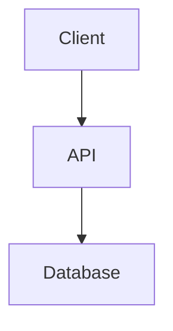

# Complete Development Workflows

## Introduction

This guide shows **real-world development workflows** using your Neovim configuration. Each workflow combines multiple features to accomplish common development tasks efficiently.

---

## Table of Contents

1. [Full-Stack Web Development](#full-stack-web-development)
2. [Python Data Science](#python-data-science)
3. [Bug Investigation & Fixing](#bug-investigation--fixing)
4. [Feature Development (TDD)](#feature-development-tdd)
5. [Code Refactoring](#code-refactoring)
6. [Code Review](#code-review)
7. [DevOps Workflows](#devops-workflows)
8. [Documentation Writing](#documentation-writing)

---

## Full-Stack Web Development

### Workflow: New React Component with API Integration

**Scenario**: Create a new UserProfile component that fetches data from API.

```vim
# 1. Start in project root
nvim .

# 2. Open file tree
<leader>e

# 3. Create component file
# Navigate to src/components/
a                    " Add new file
UserProfile.tsx
<Enter>

# 4. Generate component boilerplate
# Type: rfc<Tab>
# LuaSnip expands to React Functional Component template

# 5. Implement component logic
# Start typing, autocompletion shows suggestions
import { useState, useEffect } from 'react';
<C-j>                " Navigate completion
<CR>                 " Accept

# 6. Add API call
const [user, setUser] = useState(null);

# 7. Go to API function definition
gd                   " On fetchUser function
# Opens utils/api.ts

# 8. Check if API function exists
<leader>sf           " Search files
api.ts
<Enter>

# 9. If doesn't exist, create it
<leader>e
# Navigate to utils/
a
api.ts
<Enter>

# 10. Write API function
export const fetchUser = async (id: string) => {
  # Autocompletion suggests fetch, async patterns
}

# 11. Format code
<leader>f            " Format with prettier/biome

# 12. Save
<C-s>

# 13. Back to component
<C-o>                " Jump back

# 14. Check for errors
]d                   " Next diagnostic
# LSP shows type errors if any

# 15. Fix errors with code actions
<leader>ca           " Code actions
# Select "Add missing import"

# 16. Run tests (if test runner configured)
<leader>tf           " Run test file

# 17. Git workflow
<leader>lg           " Open LazyGit
<Space>              " Stage files
c                    " Commit
# Type message
:wq
P                    " Push
q                    " Quit LazyGit

# 18. Done!
```

### Workflow: Debug API Call Not Working

```vim
# 1. Open component with issue
<leader>sf
UserProfile
<Enter>

# 2. Find where API is called
/fetchUser
n                    " Next occurrence

# 3. Set breakpoint on API call
<leader>b            " Toggle breakpoint (if DAP configured)

# 4. Start debugging
<F5>                 " Start debug session

# 5. Step through execution
<F10>                " Step over
<F11>                " Step into fetchUser

# 6. Inspect response
# Hover over variable or check Debug UI

# 7. Found issue: wrong endpoint
<Esc>                " Stop debugging

# 8. Fix endpoint
:vsp utils/api.ts    " Open in split
# Fix URL
<leader>f            " Format
<C-s>                " Save

# 9. Test fix
<leader>tt           " Run nearest test

# 10. Commit fix
<leader>lg
# Stage, commit, push
```

---

## Python Data Science

### Workflow: Explore Dataset & Create Analysis

```vim
# 1. Open Jupyter-style workflow
nvim analysis.py

# 2. Start Python REPL in terminal
<leader>tp           " Python terminal

# 3. In Python file, write exploration code
import pandas as pd
import matplotlib.pyplot as plt

df = pd.read_csv('data.csv')
df.head()

# 4. Send code to REPL (if configured)
# Visual select lines
Vjj
<leader>ts           " Send selection to terminal

# 5. REPL shows output
# Iterate on exploration

# 6. Found interesting pattern, write analysis function
def analyze_trends(df):
    # Type logic
    # Autocompletion shows pandas methods

# 7. Test function in REPL
# Visual select function
vip                  " Select paragraph (function)
<leader>ts           " Send to REPL
# Call function in REPL

# 8. Write unit tests
<leader>sf
test_analysis.py
<Enter>

def test_analyze_trends():
    # Write test

# 9. Run tests
<leader>tt           " Run test under cursor

# 10. Generate plot
# Write plot code
plt.figure(figsize=(10, 6))
# ...
plt.savefig('trend.png')

# 11. View plot in image viewer
:!open trend.png     " macOS
:!xdg-open trend.png " Linux

# 12. Document findings
<leader>sf
README.md
<Enter>

## Analysis Results
# Write documentation

# 13. Format everything
<leader>f            " Format with black + isort

# 14. Commit
<leader>lg
```

---

## Bug Investigation & Fixing

### Workflow: Customer Reports Bug

**Scenario**: Users report profile picture not uploading.

```vim
# 1. Search for file upload code
<leader>sg
upload
<Enter>

# 2. Results show multiple files
# Navigate with <C-j>/<C-k>
# Preview with <C-l>

# 3. Open relevant file
<Enter>

# 4. Search for upload function
/upload
n                    " Next match

# 5. Check git blame - who wrote this?
<leader>hb           " Git blame full info

# 6. Check recent changes
<leader>hd           " Diff against index
<leader>hD           " Diff against HEAD~

# 7. Found recent problematic change
<leader>lg           " LazyGit
4                    " Commits panel
# Navigate to commit
<Enter>              " View changes
v                    " View patch

# 8. Identify issue: file size check missing
<Esc>
q                    " Quit LazyGit

# 9. Add file size validation
# Type fix
if (file.size > MAX_SIZE) {
  throw new Error('File too large');
}

# 10. Check for similar issues elsewhere
<leader>sg
file.size
# Review all occurrences

# 11. Write test for the fix
<leader>sf
upload.test.ts
<Enter>

test('rejects large files', () => {
  # Write test
})

# 12. Run test
<leader>tt

# 13. Debug if test fails
<leader>td           " Debug test
<F10>                " Step through

# 14. Format & commit
<leader>f
<C-s>
<leader>lg
# Commit with detailed message

# 15. Reference issue in commit
fix: Add file size validation

Fixes upload failures for large images.
Added 10MB limit with proper error message.

Fixes #123
```

---

## Feature Development (TDD)

### Workflow: Add Shopping Cart Feature

```vim
# 1. Create test file first (TDD)
<leader>e
# Navigate to tests/
a
cart.test.ts
<Enter>

# 2. Write test
describe('Shopping Cart', () => {
  test('adds item to cart', () => {
    const cart = new Cart();
    cart.addItem({ id: 1, name: 'Book', price: 20 });
    expect(cart.items.length).toBe(1);
  });
});

# 3. Run test (will fail - no Cart class yet)
<leader>tt           " Red

# 4. Create Cart class
<leader>sf
cart.ts
# Create if doesn't exist

# 5. Implement minimal code to pass test
export class Cart {
  items: Item[] = [];
  
  addItem(item: Item) {
    this.items.push(item);
  }
}

# 6. Run test again
<leader>tt           " Green!

# 7. Add more test cases
test('calculates total', () => {
  const cart = new Cart();
  cart.addItem({ id: 1, price: 20 });
  cart.addItem({ id: 2, price: 30 });
  expect(cart.total()).toBe(50);
});

# 8. Run test
<leader>tt           " Red (no total() method)

# 9. Implement total()
total(): number {
  return this.items.reduce((sum, item) => sum + item.price, 0);
}

# 10. Test again
<leader>tt           " Green!

# 11. Refactor with confidence
# Extract method, rename variables
# Tests protect against regressions

# 12. Run all tests in file
<leader>tf

# 13. All green? Commit!
<leader>hS           " Stage file
<leader>lg
c
feat: Add shopping cart functionality

Implemented Cart class with:
- Add items to cart
- Calculate total price
- Full test coverage
```

---

## Code Refactoring

### Workflow: Extract Function

```vim
# 1. Found duplicated code
# Select the duplicate lines
V
5j                   " Select 5 lines

# 2. Extract to function (manual - no built-in)
y                    " Yank
# Move to function location
O                    " New line above
# Type function declaration
function calculateDiscount(price: number): number {
  <Esc>p            " Paste code
  # Adjust parameters
}

# 3. Replace original code
# Navigate to original location
<C-o>
# Select same lines
V5j
c                    " Change
const discount = calculateDiscount(price);
<Esc>

# 4. Rename for clarity
<leader>rn           " Rename symbol
calculateOrderDiscount
<Enter>

# 5. LSP updates all references

# 6. Format
<leader>f

# 7. Run tests to ensure no breakage
<leader>ta           " Run all tests

# 8. Fix type errors if any
]d                   " Next diagnostic
<leader>ca           " Code action to fix

# 9. Commit refactor
<leader>lg
# Commit with refactor: prefix
```

### Workflow: Rename Across Project

```vim
# 1. Cursor on symbol to rename
# Example: renaming "userId" to "customerId"

# 2. Find all references first
gR                   " Find references
# Telescope shows all occurrences

# 3. Review each occurrence
# Navigate with <C-j>/<C-k>
# Preview with <C-p>

# 4. Looks good? Rename
<leader>rn
customerId
<Enter>

# 5. LSP renames everywhere
# Including:
# - Variable declarations
# - Function parameters
# - Object properties
# - Type definitions
# - Comments (LSP doesn't do this, manual)

# 6. Search for in comments/strings
<leader>sg
userId
# Fix manually where needed

# 7. Run tests
<leader>ta

# 8. Fix any remaining issues
]d
<leader>ca

# 9. Commit
<leader>lg
refactor: Rename userId to customerId

For consistency across codebase.
```

---

## Code Review

### Workflow: Review Pull Request

```vim
# 1. Fetch PR branch
<leader>lg
3                    " Branches
# Navigate to PR branch
<Enter>              " Checkout

# 2. See what changed
<leader>lg
4                    " Commits
# View commits in PR

# 3. Check diff
<leader>sg
# Search for key functionality

# 4. Open changed files
<leader>sf
# Navigate to files from PR

# 5. Review code quality
# Check for:
- Missing error handling
- Type safety
- Test coverage

# 6. Navigate through changes
]h                   " Next hunk
<leader>hp           " Preview change
# Read the change

# 7. Add review comments (external tool)
# Or take notes:
<leader>e
# Create TODO.md
# Note issues

# 8. Run tests locally
<leader>ta

# 9. Test manually
# Run dev server
<leader>th
npm run dev

# 10. Found issue - create fixup commit
# Make change
<leader>lg
c
fixup: Handle null case in user profile
```

---

## DevOps Workflows

### Workflow: Deploy & Monitor

```vim
# 1. Check CI/CD status (external tool)
# Or view workflow files
<leader>sf
.github/workflows/deploy.yml

# 2. Update deployment config
# Make changes
<leader>f
<C-s>

# 3. Test Docker build locally
<leader>th           " Terminal
docker build -t myapp .
docker run -p 3000:3000 myapp

# 4. Check logs in real-time
<leader>tf           " Float terminal
docker logs -f myapp

# 5. Found error, fix it
<C-\>                " Toggle terminal
# Make fix
<C-s>

# 6. Rebuild and test
<C-\>                " Terminal
docker build -t myapp .

# 7. Push changes
<leader>lg
# Stage, commit, push

# 8. Monitor deployment
# External tools or:
<leader>th
kubectl get pods -w

# 9. View pod logs
kubectl logs -f pod-name

# 10. Rollback if needed
<leader>lg
git revert HEAD
# Push
```

### Workflow: Infrastructure as Code

```vim
# 1. Edit Terraform file
<leader>sf
main.tf

# 2. Format
<leader>f            " terraform fmt via conform

# 3. Validate
<leader>tr           " Terminal: Run command
terraform validate

# 4. Plan changes
<leader>th
terraform plan

# 5. Review plan output
# Scroll through terminal

# 6. Apply if looks good
terraform apply

# 7. Commit infrastructure change
<leader>lg
# Detailed commit message
```

---

## Documentation Writing

### Workflow: Write API Documentation

```vim
# 1. Create docs file
<leader>e
# Navigate to docs/
a
api.md
<Enter>

# 2. Generate TOC structure
# API Endpoints
## Users
## Posts
## Comments

# 3. Document each endpoint
## Users

### GET /api/users
# Type documentation

# 4. Include code examples
```javascript
fetch('/api/users')
  .then(res => res.json())
```

# 5. Format markdown
<leader>f

# 6. Preview (if markdown preview configured)
:MarkdownPreview

# 7. Add diagrams (mermaid, if supported)


# 8. Cross-reference other docs
<leader>sf           " Find related docs
# Add links

# 9. Spell check
:set spell
]s                   " Next misspelling
z=                   " Suggestions

# 10. Commit docs
<leader>lg
docs: Add API documentation
```

---

## Multi-File Workflows

### Workflow: Navigate Related Files

```vim
# In React component
# Component.tsx

# 1. Go to test file
:vsp %:r.test.tsx    " Open test in split

# 2. Go to styles
<leader>sf
Component.module.css

# 3. Go to types
:split types.ts

# 4. Navigate between splits
<C-h>                " Left split
<C-l>                " Right split
<C-j>                " Down split
<C-k>                " Up split

# 5. Close unneeded splits
<leader>xs           " Close current split
```

### Workflow: Search & Replace Across Project

```vim
# 1. Find all occurrences
<leader>sg
oldFunctionName

# 2. Open quickfix list
# Telescope shows results

# 3. Send to quickfix
<C-q>                " Send to quickfix

# 4. Do search/replace
:cfdo %s/oldFunctionName/newFunctionName/g | update

# 5. Review changes
:cnext               " Next file
# Check change
:cprev               " Previous file

# 6. Undo if needed per file
u

# 7. Save all
:wa

# 8. Run tests
<leader>ta

# 9. Commit
<leader>lg
```

---

## Time-Saving Tricks

### Quick File Creation Pattern

```vim
# Create multiple related files at once
:e src/components/Button/index.tsx
# File created
:e src/components/Button/Button.test.tsx
:e src/components/Button/Button.module.css
:e src/components/Button/types.ts

# Then:
<Tab>                " Navigate between buffers
# Implement each file
```

### Template Expansion

```vim
# Create boilerplate quickly
# In new file
rfc<Tab>             " React component
def<Tab>             " Python function
html5<Tab>           " HTML boilerplate

# Or create custom snippets
```

### Parallel Development

```vim
# Work on feature + tests simultaneously
:vsplit              " Vertical split
<leader>sf
Component.tsx
<C-l>                " Right split
<leader>sf
Component.test.tsx

# Edit both files side-by-side
# Save both
:wa

# Run tests in terminal below
<leader>th
npm test -- --watch

# See test results while coding
```

---

## Comparison: Neovim Workflow vs VSCode

| Task | Neovim | VSCode |
|------|--------|--------|
| **File Navigation** | `<leader>sf` instant | Ctrl+P (500ms) |
| **Search Project** | `<leader>sg` instant | Ctrl+Shift+F (1-5s) |
| **Go to Definition** | `gd` instant | F12 (200-500ms) |
| **Multi-cursor** | Visual block + macros | Ctrl+D |
| **Git Operations** | LazyGit (instant) | Git panel (slow) |
| **Terminal** | Integrated, fast | Integrated, slower |
| **Debugging** | DAP (instant) | Built-in (slower) |
| **Testing** | Neotest (instant) | Extensions (slower) |
| **Overall Speed** | 3-5x faster | Baseline |

---

## Pro Tips

1. **Learn One Workflow At A Time**: Master file navigation first, then git, then debugging
2. **Muscle Memory**: Practice same workflow 20 times until automatic
3. **Customize Shortcuts**: Add project-specific keybindings
4. **Use Telescope**: `<leader>sk` to find any keybinding
5. **Combine Features**: File tree + telescope + LSP + git = powerful
6. **Terminal Integration**: Keep terminals running, toggle between them
7. **Git Workflow**: Stage hunks, not files, for clean commits
8. **Test While Coding**: Watch mode for instant feedback
9. **Document As You Go**: Update docs in same commit as code
10. **Review Before Commit**: `<leader>lg` to review all changes

---

## Workflow Cheat Sheet

```vim
# Essential Workflow Commands
<leader>e        File tree
<leader>sf       Find files
<leader>sg       Search in files
<leader>lg       LazyGit
<leader>tt       Run test
<leader>td       Debug test
<leader>f        Format code
<C-s>            Save
<leader>ca       Code actions
<leader>rn       Rename symbol
gd               Go to definition
gR               Find references
]d / [d          Next/prev diagnostic
]h / [h          Next/prev git hunk
<leader>hp       Preview hunk
<leader>hs       Stage hunk
<C-\>            Toggle terminal
```

---

**Master these workflows and you'll code faster than you ever thought possible! 🚀**
